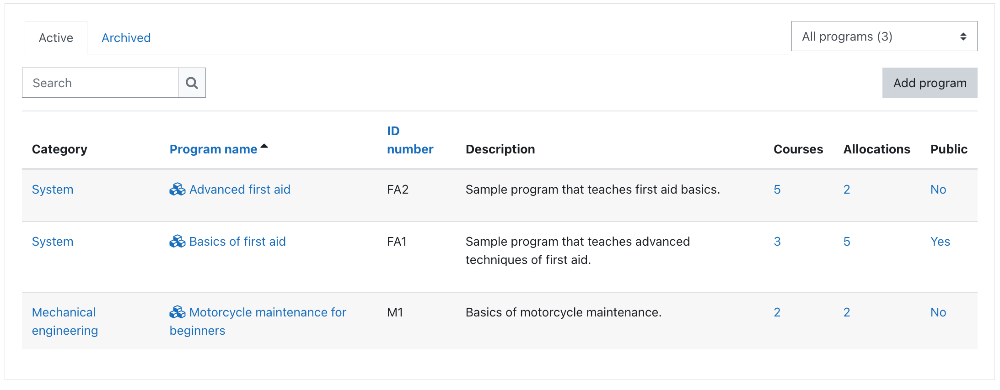

## Program management overview

Programs, also known as learning pathways, can be defined as sets of courses
with optional completion order and other sequencing criteria.

_Programs for Moodle_ is a general tool that can be used in different ways, such as:

1. Bulk enrolling learners into sets of courses and establishing a clearly defined learning path with completion criteria.
2. Creation of non-public course catalogue where visibility is controlled by cohort membership.
3. Delegation of individual course enrolments through programs outside of the course context.

Software implementation of programs can be divided into:

* program visibility - controlling who can see a program and related courses in Program catalogue
* program allocation - granting of access to a program and its courses 
* program completion - tracking of program completion and enforcing of course completion order
* program notifications

Programs can be created in system or course category context levels. By default only users
with _Manager_ and _Editing teacher_ roles can access the program management UI.

Site managers may access the program management UI from __Site administration / Programs / Program management__.
Other users with _View program management_ capability can use a workaround by clicking _Program catalogue_
link in _My programs_ dashboard block and then _Program management_ button in the _Program catalogue_.

### Program management capabilities

Following capabilities are used to control access to program management:

* __View program management__ (enrol/programs:view) - browse programs in system or course category, view program details and allocated users.
* __Add and update programs__ (enrol/programs:edit) - create programs and update existing program settings
* __Delete programs__ (enrol/programs:delete) - delete programs and all user allocations
* __Add course to programs__ (enrol/programs:addcourse) - course level capability allowing user to add the course to any programs where they have enrol/programs:edit capability
* __Allocate students to programs__ (enrol/programs:allocate) - the meaning is defined by allocation source, for manual allocation it allows user to allocate and deallocate students manually
* __Manage other completion evidence__ (enrol/programs:manageevidence) - allows user to provide alternative completion evidence for course or course set
* __Advanced program administration__ (enrol/programs:admin) - special capability for risky and low level operations related to programs and allocations

### Program management documentation

* [General program settings](program_general.md)
* [Program content](program_content.md)
* [Program visibility](program_visibility.md)
* [Program allocation](program_allocation.md)
* [Program completion tracking](program_completion.md)

