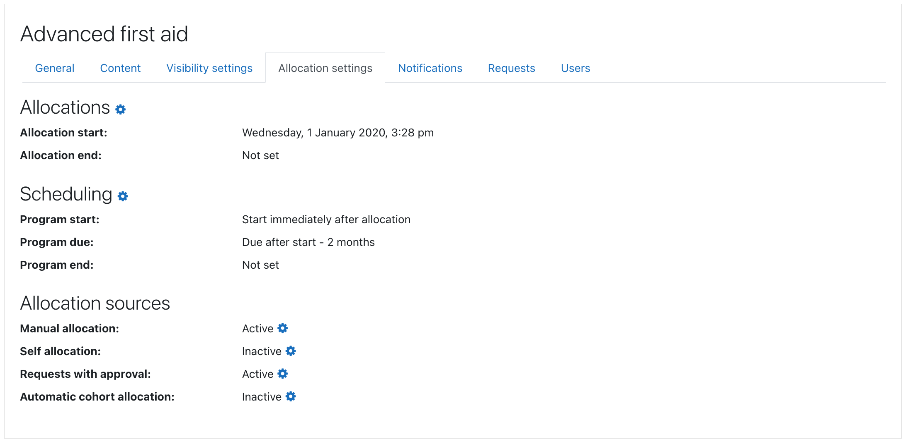
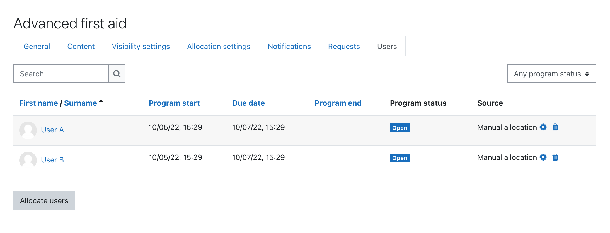

## Program allocation settings

Program allocation is similar to course enrolment, program enrolment plugin fully controls
user enrolments in courses including enrolment suspensions and unenrolments.

The word allocation was selected to make it clear it is not the same thing as course enrolment,
instead programs plugin is responsible for automatic enrolment, suspending and unenrolments
in courses that are part of program.

Program allocation settings specify formulas for calculation of following dates during user allocation:

1. __Program start date__ setting - required; relative to allocation date or fixed date
2. __Program due date__ setting - optional; relative to start date or fixed date
3. __Program end date__ setting - optional; relative to start date or fixed date

Allocations are restricted by Allocation start and end dates.

## Student allocations to programs

Students may be allocated to programs via following allocation sources:

* __Self allocation__ - user clicks a button in the Program catalogue to self-allocate, there is an optional access key and max user limit
* __Allocation request with approval__ - user requests allocation from Program catalogue, manager later confirms it
* __Manual allocation__ - manager with _enrol/program:allocate_ capability may allocate students manually
* __Automatic cohort allocation__ - all visible cohort members are automatically allocated to program

Please note it is actually not necessary to allocate students to programs at all
because the Program catalog may offer regular course enrolment methods instead.

During user allocation a custom program schedule is calculated for each user
from program allocation settings. The schedule consists of program start date,
optional program due date and optional program end date.

_See [Program management overview](management.md) for more information._