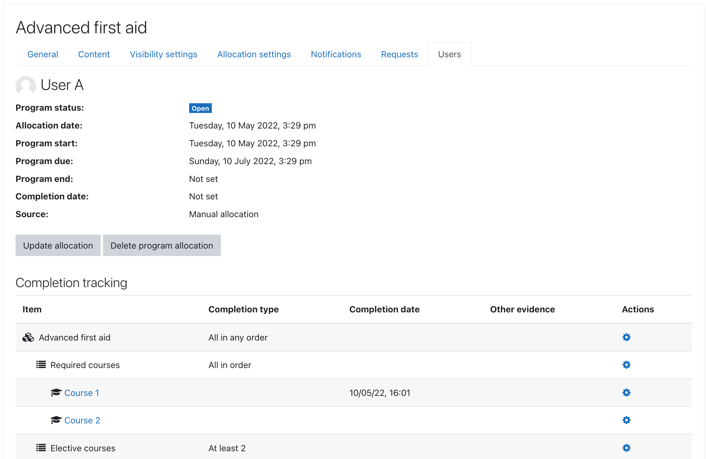

## Program completion tracking

Students cannot access program courses before program start and after program end dates.
Suspended course enrolments are created in all program courses during user allocation.
Later enrolments are automatically activated and roles assigned in accordance
with program sequencing rules.

There are 5 important dates for each user allocation:

1. __Program allocation date__ - for record keeping, but also a base for all other relative dates.
2. __Program start date__ - user must not be able to access any program courses before this date, user enrolments should be created at this date, enrolments must be suspended in courses with unfulfilled prerequisites
3. __Program due date__ - optional target date for program completion, if not program is not completed at this date then program is marked as overdue for the user
4. __Program end date__ - optional closing date for program, user must not be able to access the program courses after this date.
5. __Program completion date__ - program completion date for given user, NULL means program is not completed yet

The dates 2. - 4. are calculated at the time of user allocation using the program allocation settings.

All user dates for program can be manually updated later.

_See [Program management overview](management.md) for more information._