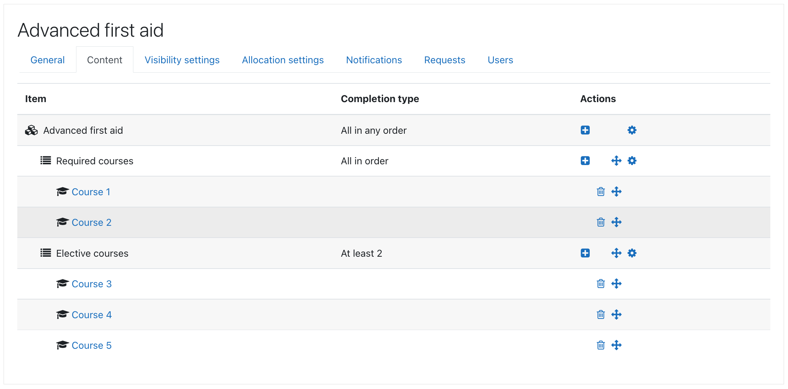

## Program content

Program content is represented as course set structure that contains courses
and other nested course sets. Course set completion can be __All in order__, __All in any order__,
or __At least X__. Program is marked as completed when top course set is completed.

Program content should not be changed after users are allocated to a program.
Ff user is unallocated from a program their course data may be lost due to unenrolment.

_See [Program management overview](management.md) for more information._