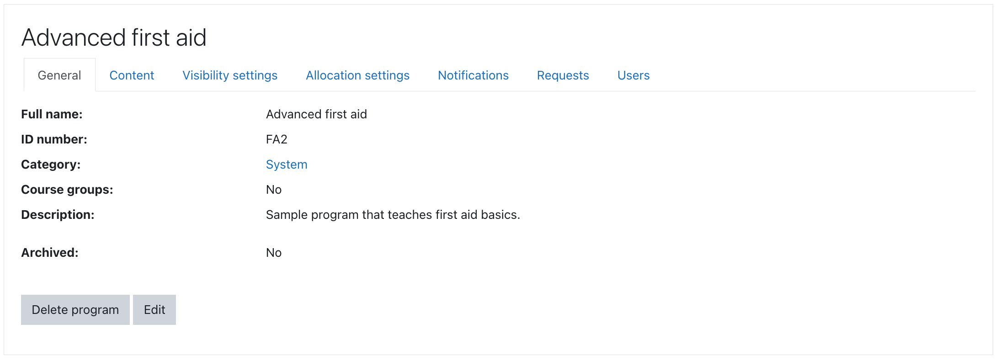

## General program settings

Programs are identified by their names and unique idnumbers. Programs can be created in system context or category contexts.

The whole program or individual allocations can be marked as _archived_ which effectively
freezes user progress through program courses and hides it from students.

_See [Program management overview](management.md) for more information._