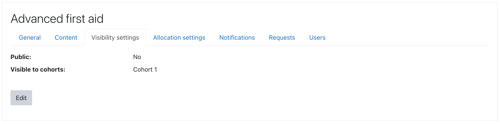

## Program visibility

Program visibility does not depend on any roles, capabilities or contexts,
instead it can be restricted via membership to cohorts or made public for all users.
If user can see a program then they can also see information about program courses,
even if courses are hidden elsewhere.

Students may use _Program catalogue_ to browse available programs and relevant
courses. Some programs may allow user self-allocation from Program catalogue.
Standard course enrolment methods can be used instead of student allocations too.

Program visibility in Program catalogue is controlled by:

* public flag in visibility settings - if 1, then all site users may see the program in catalog
* allowed list of cohorts for each program - cohort members may see the program in catalog
* archived flag in general settings - archived programs are generally not visible

_Program catalogue_ is an optional feature, its purpose is to supplement or
even replace standard course search and browsing interfaces.

All programs that user is allocated to will be displayed in their learning
dashboard in _My Programs_ block unless the archived program flag is set.

Program management UI is using a dedicated capability _enrol/program:view_ in
program context, this capability is not intended for students.

_See [Program management overview](management.md) for more information._